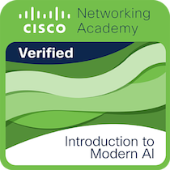
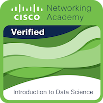
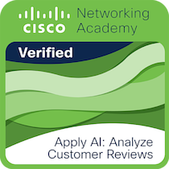

<div align="center">


<a href="https://git.io/typing-svg">
  
</a>

<br/>

[](https://www.linkedin.com/in/priyanshu-upadhyay-cse)
[](https://github.com/Priyanshu-Upadhyay-27)
[](https://priyanshu-upadhyay-portfolio.netlify.app)

<br/>


</div>

---

## 🧠 About Me

```python
priyanshu = {
    "name"       : "Priyanshu Upadhyay",
    "college"    : "Krishna Institute of Engineering & Technology (KIET)",
    "degree"     : "B.Tech — Computer Science",
    "location"   : "Ghaziabad, India 🇮🇳",
    "focus"      : ["Machine Learning", "Generative AI", "MLOps"],
    "currently"  : "Classic ML & Generative AI 🧠",
    "learning"   : ["DSA/Problem Solving", "Deployment", "LLM Systems"],
    "open_to"    : ["Internships 🔍", "Full-time Roles 💼", "Collaborations 🤝"],
    "fun_fact"   : "LLMs look intelligent, but internally they are just billions of numbers predicting the next token. 🧊"
}
```

---

## 🛠️ Tech Stack

<div align="center">

**💻 Languages**


**📊 ML & Data Science**


**⚙️ MLOps**


**🤖 GenAI & CV**


**🧰 Tools & Platforms**


</div>

---

## 🌟 Featured Projects

<div align="center">

| 🚀 Project | 📝 Description | 🛠️ Stack | 🔗 |
|:----------|:--------------|:--------|:-:|
| **Customer Churn Prediction & MLOps Pipeline** | End-to-end ML system with custom Sklearn pipeline, XGBoost classifier achieving 85% recall & ROC-AUC 0.82, with decoupled FastAPI inference backend from Streamlit UI | `XGBoost` `FastAPI` `Scikit-learn` `Streamlit` | [GitHub](https://github.com/Priyanshu-Upadhyay-27/end-to-end-churn-ml) · [Demo](https://priyanshu-retention-intelligence.streamlit.app/) |
| **QnA With Jupyter — Relational RAG System** | Notebook parsing via Python AST to extract variables & generate semantic descriptions; relational RAG architecture achieving ~80% correct contextual dependency retrieval | `LangChain` `Python AST` `RAG` `LLMs` | [GitHub](https://github.com/Priyanshu-Upadhyay-27/QnA_With_Jupyter) |
| **Lending Club Loan Risk Analysis** | End-to-end ML pipeline on ~2.2M records — KMeans clustering for segmentation + XGBoost classifier with ROC-AUC 0.73, deployed via Streamlit | `XGBoost` `KMeans` `Scikit-learn` `Streamlit` | [GitHub](https://github.com/Priyanshu-Upadhyay-27/LoanClassinator) · [Demo](https://loanclassinator-classifier-cluster.streamlit.app/) |

</div>

---

## 🏆 Achievements

<div align="center">

| 🏅 Recognition | 📝 Details |
|:--------------|:----------|
| **Clash of Codes** <br>*(Finalist, Top 1%)* | **1000+ participants, 256+ teams:** Built an AI virtual canvas enabling air-drawing via hand gesture recognition (OpenCV), with voice-controlled navigation, multi-color support, and Gemini integration to solve problems drawn on the canvas. |
| **HackSpire, IPEC** <br>*(Finalist)* | Developed a computer vision-based water footprint calculator that identifies crop types from images and estimates agricultural water consumption to guide sustainable irrigation decisions. |
| **Innotech** <br>*(Finalist)* | Reached the final round in KIET's largest technical fest. |

</div>

---

## 📜 Certifications

<div align="center">

  &nbsp;&nbsp;&nbsp;
  
  
  <br/><br/>
  
  &nbsp;&nbsp;
  &nbsp;&nbsp;
  

</div>

---

## 📊 GitHub Analytics

<div align="center">


&nbsp;&nbsp;


</div>

<div align="center">
  
</div>

---

## 🏅 Trophies

<div align="center">
  &nbsp;&nbsp;&nbsp;
  
</div>

---

## 📈 Contribution Graph & Activity

<div align="center">
  <picture>
    <source media="(prefers-color-scheme: dark)" srcset="https://raw.githubusercontent.com/Priyanshu-Upadhyay-27/Priyanshu-Upadhyay-27/output/github-contribution-grid-snake-dark.svg">
    <source media="(prefers-color-scheme: light)" srcset="https://raw.githubusercontent.com/Priyanshu-Upadhyay-27/Priyanshu-Upadhyay-27/output/github-contribution-grid-snake.svg">
    
  </picture>
</div>

<br/>

---

<div align="center">

### 🤝 Let's Build Something Intelligent Together

[](mailto:priyanshuupadhyay2005@gmail.com)

<br/>

<a href="https://www.linkedin.com/in/priyanshu-upadhyay-cse">
  
</a>

<br/>


</div>
